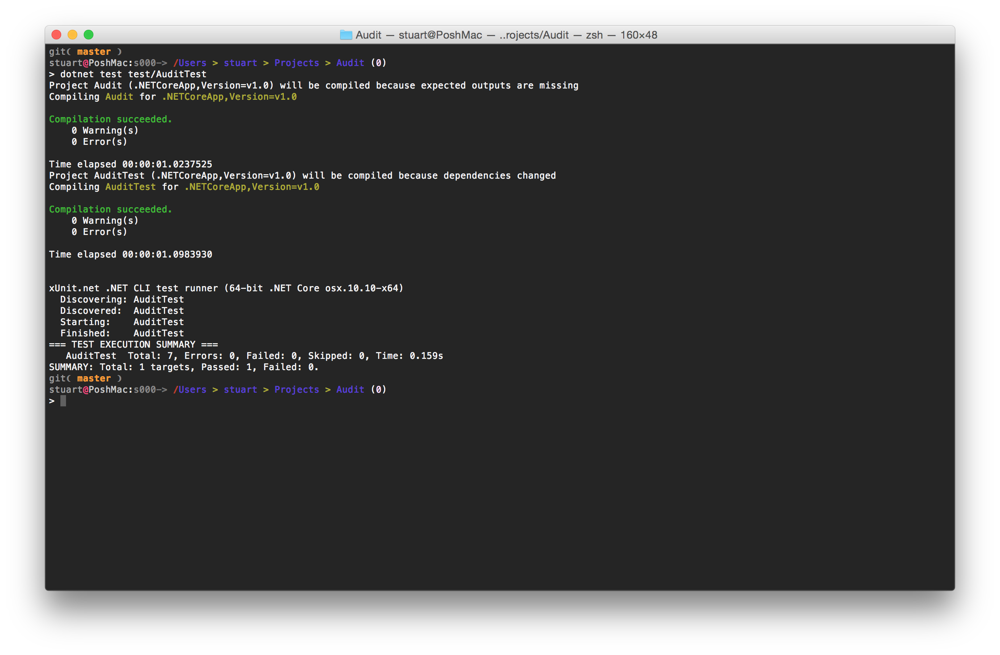
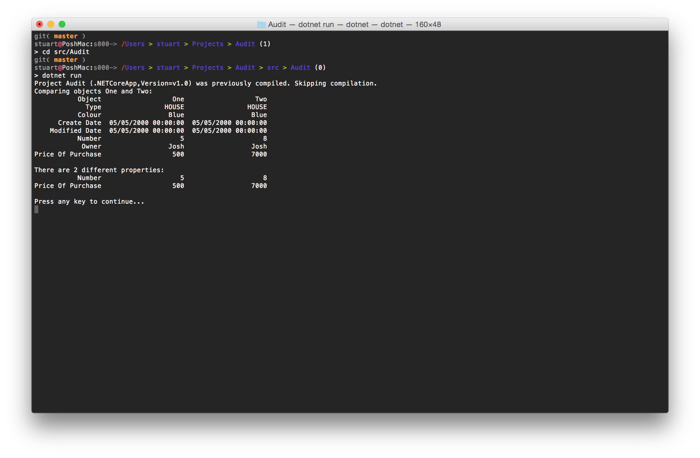
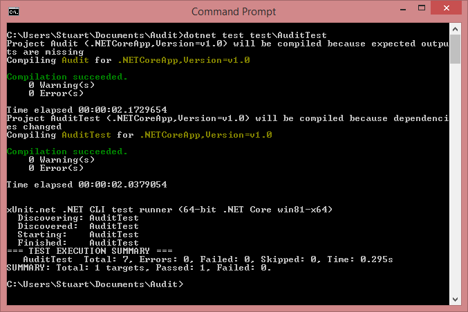
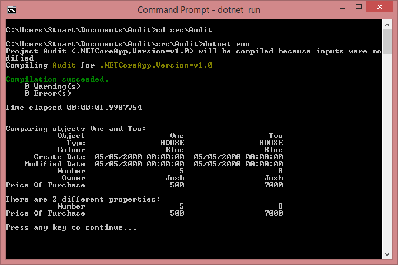
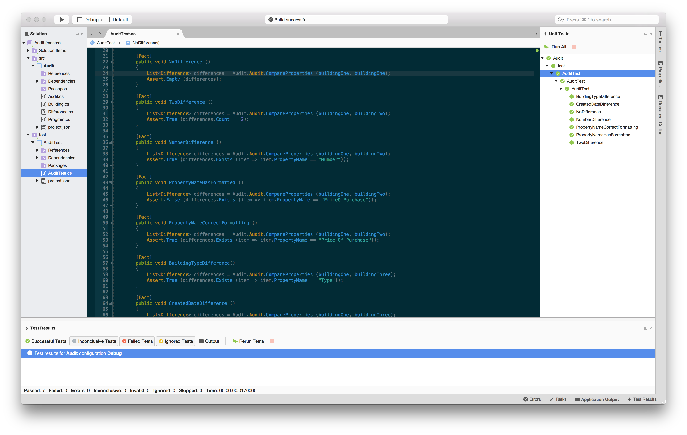
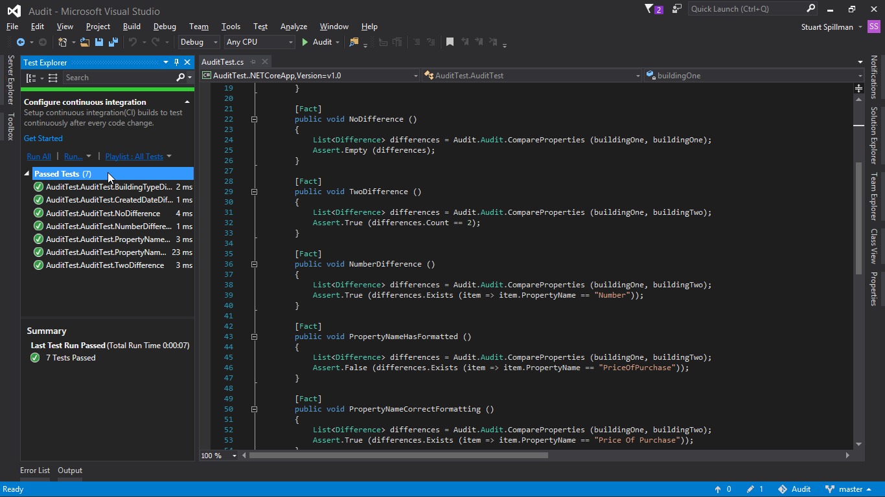

Audit
=====

This a solution to a programming task to use C# to work out the differences between the public properties of two objects.

The solution is in the form of a .NET Core application and can be used on Windows, Mac and Linux. It includes tests using xUnit.net.

To get started with .NET Core, please visit [Microsoft's guide](https://www.microsoft.com/net/core) for your platform.

Before running, 'dotnet restore' will need to be used to get any dependencies.

Examples:

Mac OS X

Windows 8.1

Xamarin Studio

Visual Studio

